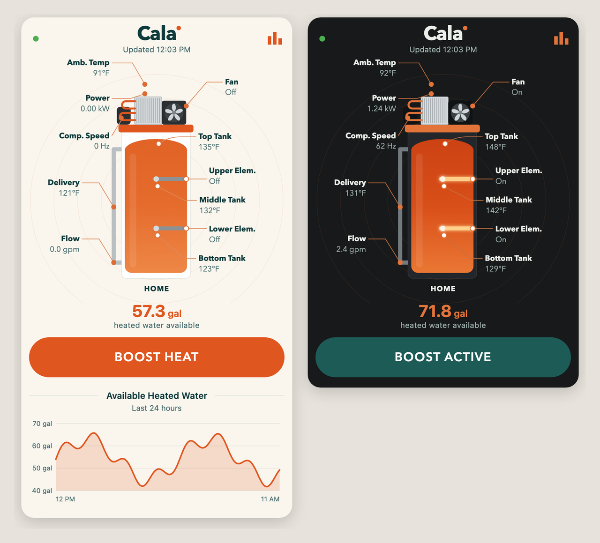
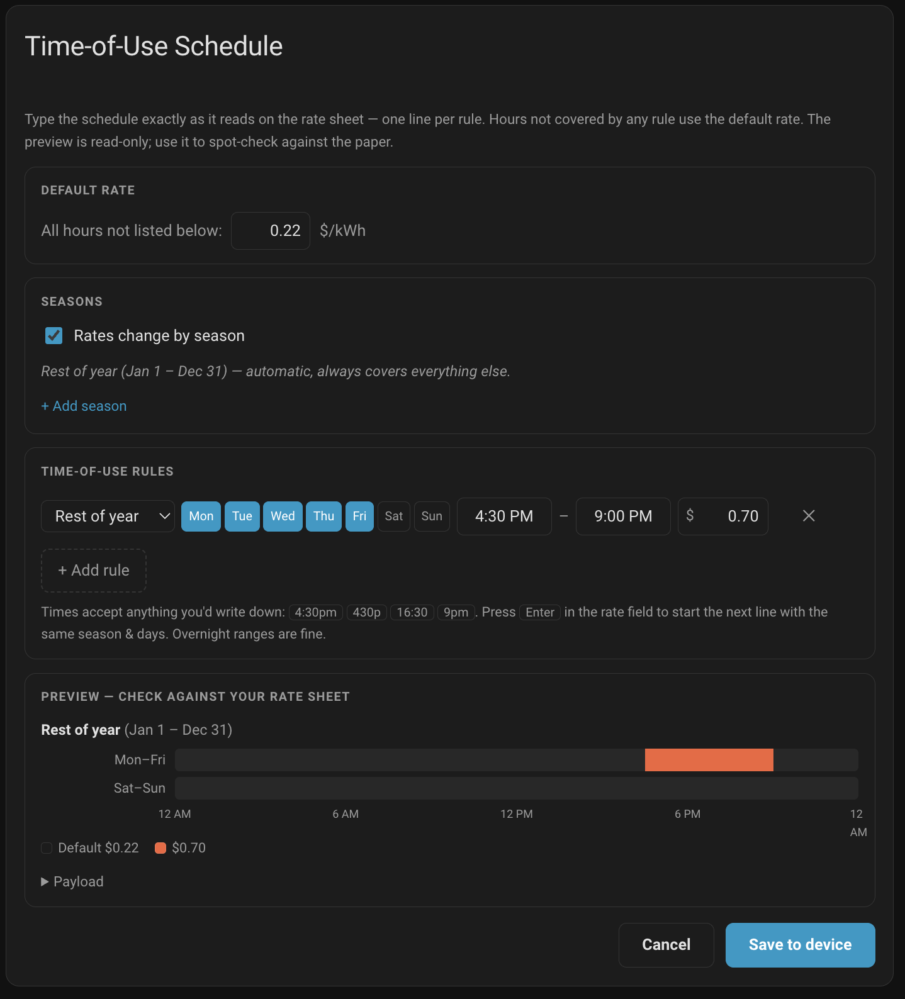

# Cala (MQTT)

[](https://github.com/cala-systems/cala-home-assistant/actions/workflows/ci.yml)
[](https://github.com/cala-systems/cala-home-assistant/releases)
[](https://hacs.xyz/docs/faq/custom_repositories/)
[](LICENSE)

Home Assistant custom integration for Cala heat pump water heaters: local MQTT pairing, live telemetry, boost control, and time-of-use scheduling.

## Prerequisites

Before starting:

- Cala device powered and connected to WiFi, running current firmware
- Home Assistant running and accessible
- MQTT broker installed and running (Mosquitto recommended)

If you do not have MQTT installed:

1. Go to **Settings** → **Add-ons**
2. Install **Mosquitto broker**
3. Start it

## Installation

Install the Cala **integration** (the Home Assistant component that connects to your Cala water heater). The physical device is set up separately in the Setup section below.

### Option A: HACS

1. Install HACS
2. HACS → Integrations → ⋮ → Custom repositories
3. Add this repository URL
4. Category: Integration
5. Install "Cala"
6. Restart Home Assistant

### Option B: Manual copy

1. Copy the `cala` folder into `/config/custom_components/`
2. Restart Home Assistant

**Via SSH:**

```bash
# SSH into Home Assistant
ssh root@homeassistant.local
# or: ssh root@<HA_IP_ADDRESS>

# Create custom_components folder if needed
cd /config
mkdir -p custom_components
exit

# From your local machine, copy the integration
scp -r cala root@homeassistant.local:/config/custom_components/
```

## Setup

1. **Get the pairing code from your Cala water heater:** On the device display, go to **Settings** → **Advanced** → **Home Assistant**. Note the pairing code shown there.
2. After Home Assistant restarts, Cala should automatically announce itself via local discovery
3. Go to **Settings** → **Devices & Services** in Home Assistant
4. Click **Add** and complete the setup, entering the pairing code when prompted

**Preferred:** Discovery via mDNS/Zeroconf (device advertises itself)

**Fallback:** Manual setup (enter device host/port), then enter the pairing code and MQTT credentials.

## MQTT Username and Password

During setup, you will be prompted for:

- MQTT username
- MQTT password

These must match your MQTT broker credentials.

**If using Mosquitto Add-on:**

1. Go to **Settings** → **Add-ons** → **Mosquitto broker**
2. Open the **Configuration** tab
3. Create a new login and store the username and password for Cala setup

**Custom MQTT setup:** Use the credentials configured in your broker. Confirm the broker host and port are correct.

## Verifying MQTT Connection

After setup:

- Cala should appear under **Devices**
- Sensor entities should populate automatically
- No additional configuration is required

If Cala does not appear:

- Confirm MQTT broker is running
- Confirm credentials are correct
- Check logs under **Settings** → **System** → **Logs**

## Boost Mode

Boost mode heats water on demand. Each Cala device includes a boost button and exposes services for automations.

### Boost Button

On the device page, a button shows:

- **Start 24h Boost** when boost is off — starts a 24-hour boost
- **Stop Boost** when boost is on — stops the current boost

### Services

Use these in automations or scripts:

| Service            | Description                                                                             |
| ------------------ | --------------------------------------------------------------------------------------- |
| `cala.start_boost` | Start boost mode. Requires `device_id`. Optional `duration` (hours, 1–168, default 24). |
| `cala.stop_boost`  | Stop boost mode. Requires `device_id`.                                                  |

**Example (Start 24h boost):**

```yaml
service: cala.start_boost
data:
  device_id: your_device_id # e.g. phil_wil_desk or 2507xxa006
  duration: 24
```

**Example (Stop boost):**

```yaml
service: cala.stop_boost
data:
  device_id: your_device_id
```

### Boost Status

The `sensor.xxx_boost_mode_on` entity reports whether boost is active (`on`/`off`). Use it in automations or to show boost status on dashboards.

## Status Card

The integration ships a Lovelace card that redraws the Cala app's cutaway view from the device's own sensors. **No installation or resource registration is needed** — the integration serves and registers the card automatically. Add it from the dashboard card picker, or by hand:

```yaml
type: custom:cala-card
```



With a single heater that is all you need; the card auto-detects it. With more than one, pick the device in the visual editor, which writes:

```yaml
type: custom:cala-card
device: 37fec107f24747e9353c5a87a538dee9
```

The diagram is live, not a static image:

- Tank fill is interpolated from the top, upper and lower probe temperatures.
- The fan spins while `fan_on` is on (faster on `fan_speed_high`) and the rings pulse whenever compressor frequency is above zero.
- Heating elements glow when energised.
- **BOOST HEAT** presses the 24 h boost button and reads **BOOST ACTIVE** while `boost_mode_on` is on.
- Callouts open the more-info dialog for their entity; the chart icon toggles a history graph of water available.
- The status dot turns red and the card dims when the device reports anything other than Connected.

| Option | Default | Notes |
|---|---|---|
| `device` | auto-detected | Home Assistant device id; what the editor's picker sets |
| `prefix` | auto-detected | Entity-ID stem, e.g. `1_car_garage_cala_water_heater`. Use when there is no device-registry entry |
| `show_history` | `true` | Water-available chart under the button |
| `history_hours` | `24` | Chart window |
| `dark_mode` | `auto` | `never` pins the light Cala palette |
| `entities` | – | Per-key entity overrides |
| `callouts` | – | Per-slot label/entity overrides; `false` hides a slot |

Entities resolve in this order: explicit `entities` overrides, then `device`, then `prefix`, then auto-detection of the first `sensor.*cala*_top_temperature`.

## Time-of-Use Rates

The `cala.set_tou_schedule` service pushes a period-based electricity rate schedule to the device. Rates are absolute **$/kWh**. Any time not covered by a period falls back to the mandatory `defaultRate`.

**Schema rules:**

- `version` must be `1`
- `defaultRate` must be a positive float ($/kWh)
- At most **4 seasons**, **4 daySchedules** per season, **8 periods** per daySchedule
- Season `startDate`/`endDate` are inclusive `MM-DD` strings; a season may wrap the year end (e.g. `11-01` → `02-28`); season ranges must not overlap
- `days` are lowercase `sun`/`mon`/`tue`/`wed`/`thu`/`fri`/`sat`; a day may not appear in two daySchedules of the same season
- Periods use minutes since local midnight: `startMin` inclusive, `endMin` exclusive, max `1440`; periods must not overlap and must not cross midnight (split into two periods instead)

**Example:**

```yaml
service: cala.set_tou_schedule
data:
  device_id: your_device_id
  schedule:
    version: 1
    defaultRate: 0.12
    seasons:
      - startDate: "06-01"
        endDate: "09-30"
        daySchedules:
          - days: [mon, tue, wed, thu, fri]
            periods:
              - startMin: 600 # 10:00
                endMin: 840 # 14:00
                rate: 0.32
```

### Automatic publishing from a price-feed entity

Instead of calling the service directly, you can point the integration at a price entity via the **TOU rates entity** option in the integration's Configure dialog. The source format is auto-detected from the entity's attributes:

| Source                                                                 | Attribute shape                                                                |
| ---------------------------------------------------------------------- | ------------------------------------------------------------------------------ |
| [openadr3-ven-hass](https://github.com/cala-systems/openadr3-ven-hass) | `forecast`: list of 24+ `{datetime, value, hour}` entries                      |
| Nord Pool (custom component)                                           | `raw_today`: list of `{start, end, value}` entries (`raw_tomorrow` is ignored) |
| ENTSO-E (`hass-entso-e`)                                               | `prices_today` (or `prices`): list of `{time, price}` entries                  |
| Tibber price sensors                                                   | `today`: list of 24 numbers, or a list of `{startsAt, total}` entries          |

Sub-hourly entries (e.g. 15-minute Nord Pool prices) are averaged per hour. All 24 hours of the day must be covered or nothing is published.

On every state change of that entity (and once at startup), the integration:

1. Normalizes the feed into a midnight-anchored 24-hour rate array
2. Clamps zero or negative prices to a `0.001` floor — the device rejects non-positive rates, and clamping (rather than skipping the hour) preserves the price shape the planner optimizes against; one warning is logged per publish
3. Compresses it into a schedule: the most common rate becomes `defaultRate`, consecutive hours with equal non-default rates merge into periods, wrapped in a single all-year (`01-01` → `12-31`), all-days season
4. If more than 8 periods result, the 8 rates deviating most from `defaultRate` are kept and the rest are absorbed into `defaultRate` (a warning logs the maximum rate error introduced)
5. Publishes the schedule to the device, skipping the publish when the schedule is unchanged since the last successful one

Prices pass through in the feed's own currency and unit — the device normalizes relative to the daily minimum, but the on-screen display currently shows a `$` regardless of source currency.

### Demo price feed (no utility integration needed)

Add this template sensor to `configuration.yaml` and select it as the TOU rates entity; it produces a simple day/night pattern (peak 16:00–21:00):

```yaml
template:
  - sensor:
      - name: "Demo TOU Prices"
        unique_id: demo_tou_prices
        state: "{{ now().hour }}"
        attributes:
          forecast: >
            
            
              {% set h = (now().hour + i) % 24 %}
              
              
            
            {{ ns.items }}
```

The state changes every hour, which re-triggers publishing; dedup keeps the device traffic quiet since the compressed schedule doesn't change.

### Editing the schedule from a dashboard — Cala TOU card

The integration ships a custom Lovelace card with a real editing UI for transcribing a utility rate sheet. **No installation or resource registration is needed** — the integration serves and registers the card automatically. Add it to any dashboard:

```yaml
type: custom:cala-tou-card
```

With a single heater that is all you need; the card auto-detects it. With more than one, pick the
device in the visual editor, which writes:

```yaml
type: custom:cala-tou-card
device: 37fec107f24747e9353c5a87a538dee9
```

| Option | Default | Notes |
|---|---|---|
| `device` | auto-detected | Home Assistant device id; what the editor's picker sets |
| `device_id` | – | The raw Cala device id (e.g. `2507xxa006`). Overrides `device`; only needed when the device has no registry entry |



How it works:

- **Default rate** — every hour not covered by a rule uses this $/kWh value.
- **Seasons** — optional. Define only the season(s) that differ (e.g. Summer `06-01` to `09-30`); "Rest of year" exists automatically and always covers every other date, including wrap-around, so gaps and date math are impossible.
- **Rules** — one line per statement on the rate sheet: season, Mon–Sun day chips, from/to times, rate. Time fields accept anything you'd write down (`4:30pm`, `430p`, `16:30`, `9pm`) and normalize on blur; overnight ranges (9:00 PM – 7:00 AM) are fine. Press **Enter** in the rate field to start the next line pre-filled with the same season and days.
- **Overlaps are warnings, not errors** — where two rules overlap, the earlier rule wins; the affected rows get a ⚠ and the warning box spells out each conflict.
- **Preview** — read-only per-season bars with a legend show the derived schedule so you can spot-check against the paper before saving.
- **Save** — the card derives the canonical schedule (rest-of-year expanded to explicit date ranges, overlaps clipped, weekdays with identical patterns grouped), checks the device limits (4 seasons / 4 day patterns / 8 periods) with plain-language messages, and submits via the `cala.set_tou_schedule` service. Success or the device's rejection reason is shown in the card.

The card pre-fills from the last successfully published schedule, which the integration remembers per device (from any path — the service, the price feed, or the card itself) and exposes on the diagnostic `sensor.<device>_tou_schedule` entity (`schedule` attribute; state is the publish timestamp). The memory survives restarts via HA state restoration.

#### Price feed takes precedence

If you have configured a **TOU rates entity** (price feed) and it is currently producing a valid schedule, **the price feed owns the device's schedule** and the card renders read-only: a banner names the controlling feed entity, the inputs are disabled, and Save is hidden. To edit manually, remove the price-feed entity in the integration options. The card is the editing surface only when no feed is configured, or the feed is unavailable/unknown/producing no valid schedule (the fallback case). If the feed recovers while the card is open, the card switches to the read-only state on its next update.

The raw `cala.set_tou_schedule` service (Developer Tools / automations) is **not** blocked by an active feed — it is a deliberate developer escape hatch. A manual service call will publish, but the feed will overwrite it on its next tick; the card, being the normal user path, is what enforces feed-wins.

## Solar & Battery Data (Optional)

Solar and battery entity mappings are optional. Cala receives advisory data only and remains in full control of operation. No direct control commands are accepted from Home Assistant for these inputs.

## Removing the Integration

To uninstall:

1. Remove Cala from **Devices & Services**
2. Delete `/config/custom_components/cala`
3. Restart Home Assistant

## Getting help

- **Setup questions and pairing help:** [GitHub Discussions](https://github.com/cala-systems/cala-home-assistant/discussions)
- **Bugs and feature requests:** [GitHub Issues](https://github.com/cala-systems/cala-home-assistant/issues/new/choose) — the bug template lists the versions and logs that make a report actionable
- **The water heater itself (hardware, warranty, account):** [calasystems.com](https://calasystems.com)

## Releases

Releases follow [semantic versioning](https://semver.org/) and are published from `v*` tags with auto-generated notes; `custom_components/cala/manifest.json` must carry the same version as the tag (CI enforces it).
